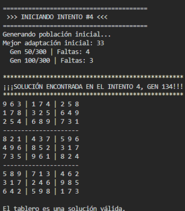
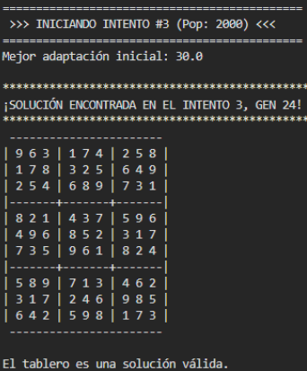
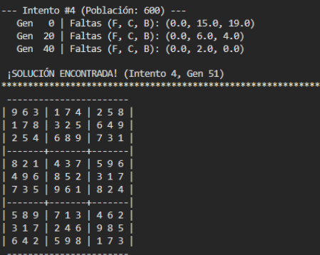

# Resolución de Sudoku mediante Algoritmos Genéticos y Computación Evolutiva

Este repositorio contiene el desarrollo y análisis comparativo de tres estrategias de Inteligencia Artificial para la resolución del Sudoku, modelado como un Problema de Satisfacción de Restricciones (CSP). Se explora la evolución desde una implementación manual hasta el uso de algoritmos multi-objetivo avanzados (NSGA-III).

**Autor:** Victoria Elizabeth Juárez Morales  
**Curso:** Programación Avanzada (Dr. Said Polanco Martagón)  
**Maestría en Ingeniería - Universidad Politécnica de Victoria**

---

##  Estructura del Proyecto

El proyecto se divide en tres enfoques evolutivos:

1.  **`desde_cero.py`**: Implementación manual (Python puro).
2.  **`con_deap.py`**: Implementación optimizada con librería DEAP (Mono-objetivo).
3.  **`NSGAIII.py`**: Enfoque Multi-objetivo con selección NSGA-III.

---

## 1. Implementación Manual (`desde_cero.py`)

Diseñada para comprender la lógica fundamental de los operadores genéticos (selección por torneo, cruce y mutación) sin dependencia de librerías externas.

###  Análisis de Resultados
* **Tiempo de Ejecución:** Variable (10 a 25+ minutos).
* **Comportamiento:** Alta inestabilidad estocástica.
* **Cuello de Botella:** La clonación de objetos (`copy.deepcopy`) y la falta de optimización nativa de Python saturan el procesador.
* **Conclusión:** Funcional para fines didácticos, pero computacionalmente costosa debido a la dificultad para escapar de óptimos locales con una tasa de mutación baja (0.1).

---

## 2. Implementación con Librería DEAP (`con_deap.py`)

Uso de **Distributed Evolutionary Algorithms in Python (DEAP)** para optimizar la gestión de memoria y estructuras de datos bajo un enfoque clásico (mono-objetivo).

###  Análisis de Resultados
* **Tiempo Promedio:** Rápido (~1.5 a 5 min dependiendo de la suerte inicial).
* **Variabilidad:** Al ser un proceso estocástico, el número de intentos requeridos fluctúa. En pruebas realizadas, la solución se encontró en rangos diversos (desde el **Intento #3** hasta el **Intento #16**).
* **Justificación Técnica:** La eficiencia de DEAP permite procesar ~1.5 millones de individuos en segundos. Esto hace viable la estrategia de "Fuerza Bruta Inteligente": realizar múltiples reinicios rápidos hasta encontrar una semilla favorable.

---

## 3. Enfoque Multi-objetivo NSGA-III (`NSGAIII.py`)

Implementación avanzada utilizando el algoritmo **Non-dominated Sorting Genetic Algorithm III**. Se transformó el Sudoku de un problema mono-objetivo a uno multi-objetivo.

###  Adaptación Técnica
* **Objetivos Divididos:** Minimizar errores en **Filas**, **Columnas** y **Cajas** independientemente. Esto permite al algoritmo atacar defectos específicos sin destruir estructuras correctas.
* **Estrategia de "Intensidad Compensada":** Para respetar la restricción académica de **Probabilidad de Mutación = 0.1 (10%)**, se diseñó un operador personalizado que realiza **4 cambios (swaps)** internos cada vez que se activa la mutación.

###  Análisis de Resultados
* **Tiempo Promedio:** ~2 a 8 minutos.
* **Variabilidad de Convergencia:** El algoritmo es robusto pero variable. Dependiendo de la complejidad del tablero y el azar, puede resolverlo tempranamente (ej. **Intento #4**) o requerir una búsqueda más extensa (ej. **Intento #41**).
* **Ventaja:** A pesar de los reinicios, el algoritmo mantiene la diversidad genética mejor que los métodos tradicionales gracias a la búsqueda en el "Frente de Pareto" (0,0,0).

---

##  Conclusión General y Veredicto

Tras analizar las tres estrategias, se concluye que **la implementación con DEAP (Mono-objetivo) es la más indicada para este problema**.

Aunque **NSGA-III** demostró ser una herramienta poderosa capaz de resolver el problema mediante la descomposición de objetivos, el Sudoku es inherentemente un problema de satisfacción de restricciones única (llegar a 0 errores). El uso de NSGA-III añade una sobrecarga computacional (cálculo de frentes de Pareto y puntos de referencia) que, aunque académica y técnicamente interesante, resulta menos directa que la optimización pura de **DEAP estándar**, la cual ofreció la mejor relación entre simplicidad de código y velocidad de convergencia.

| Método | Tiempo Aprox. | Estabilidad | Observación |
| :--- | :--- | :--- | :--- |
| **Manual** | 10 - 25+ min | Baja | Alta dependencia del azar inicial y procesamiento lento. |
| **DEAP** | 1 - 5 min | **Óptima** | **Mejor relación costo-beneficio computacional.** |
| **NSGA-III** | 2 - 8 min | Muy Alta | Excelente capacidad de exploración, pero con mayor costo computacional ("Overkill"). |